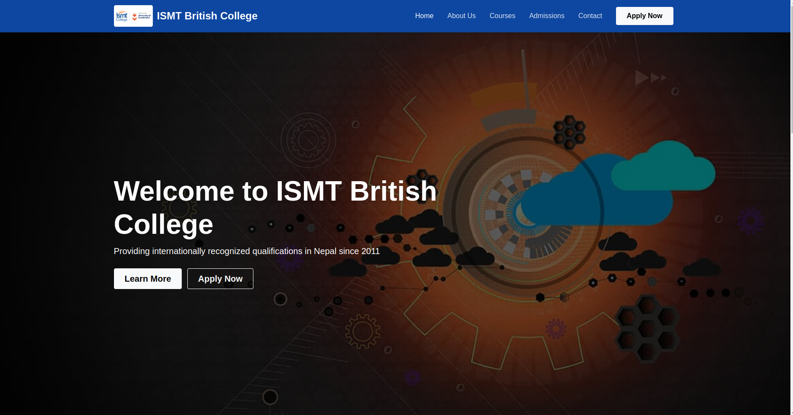

# College Website

## Project Overview
This project is a **College Website** built using HTML, CSS, and JavaScript. It consists of multiple web pages providing information about the college, its courses, admissions, contact details, and more. The website uses various images and styling files to create an engaging user interface.


---

## Folder Structure
The project is organized as follows:

```
COLLEGE-WEBSITE/
│── css/
│   └── style.css                # Stylesheet for the website
│
│── images/                      # Contains all images used on the website
│   ├── business-management.jpg
│   ├── cafeteria.jpg
│   ├── campus.jpg
│   ├── classroom.jpg
│   ├── college-building.jpg
│   ├── computer-lab.jpg
│   ├── computer-systems.jpg
│   ├── cyber-security.jpg
│   ├── hero-bg.jpg
│   ├── library.jpg
│   ├── logo.png
│   ├── mba.jpg
│   ├── students.jpg
│   └── tourism-hospitality.jpg
│
│── js/
│   └── main.js                   # JavaScript file for interactive elements
│
│── test-images/                   # Test images for different pages
│   ├── about.png
│   ├── admission.png
│   ├── contact.png
│   ├── courses.png
│   └── homepage.png
│
│── about.html                     # About page
│── admissions.html                 # Admissions page
│── contact.html                    # Contact page
│── courses.html                    # Courses page
│── index.html                      # Homepage
│── README.md                       # Project documentation
```

---

## Features
- **Responsive Design:** The website adapts to different screen sizes.
- **Interactive Elements:** JavaScript is used to enhance user interactions.
- **Informative Pages:** Dedicated pages for courses, admissions, contact, and more.
- **Media-rich Interface:** Uses high-quality images for a visually appealing layout.

---

## Technologies Used
- **HTML5** - Structure of the web pages
- **CSS3** - Styling and layout design
- **JavaScript** - Interactive features and user engagement

---

## How to Use
1. Clone this repository to your local machine:
   ```sh
   git clone https://github.com/siddhantbhattarai/college-website.git
   ```
2. Open the project folder and run the `index.html` file in a web browser.
3. Make modifications in the `css/style.css` or `js/main.js` files as needed.

---

## Future Enhancements
- Add a **backend** to handle user queries and form submissions.
- Implement a **database** to store student information.
- Integrate **animations** for a better user experience.
- Optimize **SEO and performance** for faster loading.

---

## Contribution
If you’d like to contribute:
1. Fork the repository.
2. Create a new branch (`feature-branch`).
3. Commit your changes and push to the branch.
4. Open a **pull request** for review.

---

## License
This project is open-source and available under the **MIT License**. 

---

🚀 **Happy Coding!**

